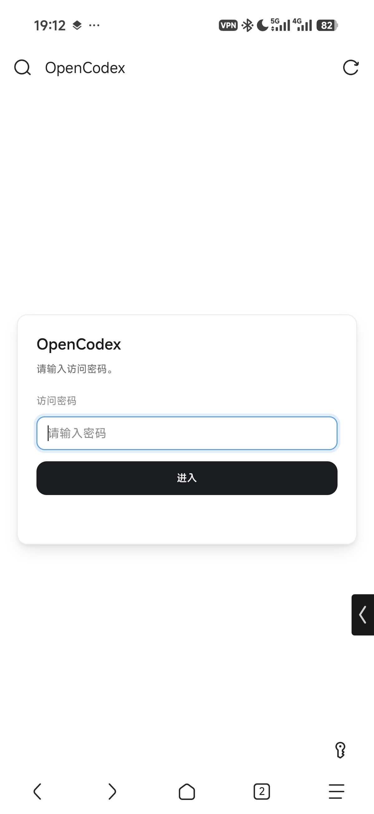
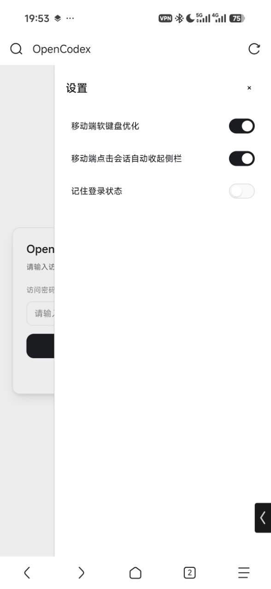
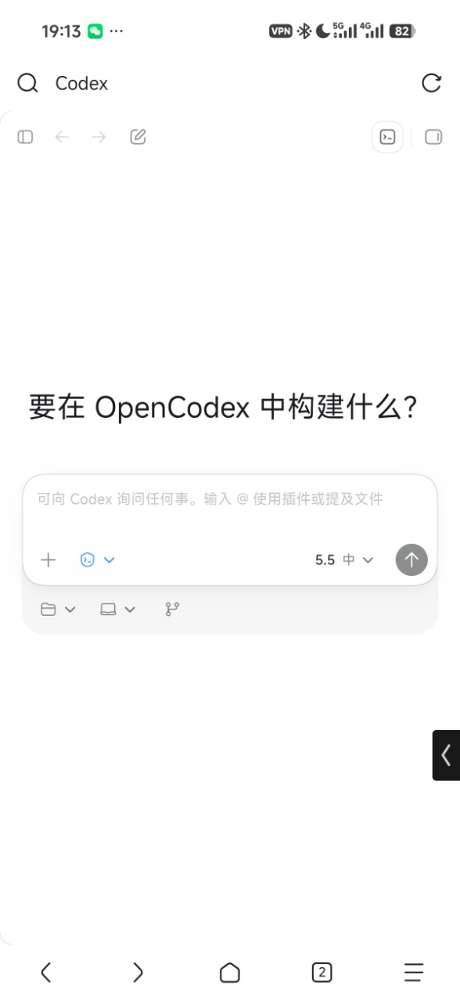
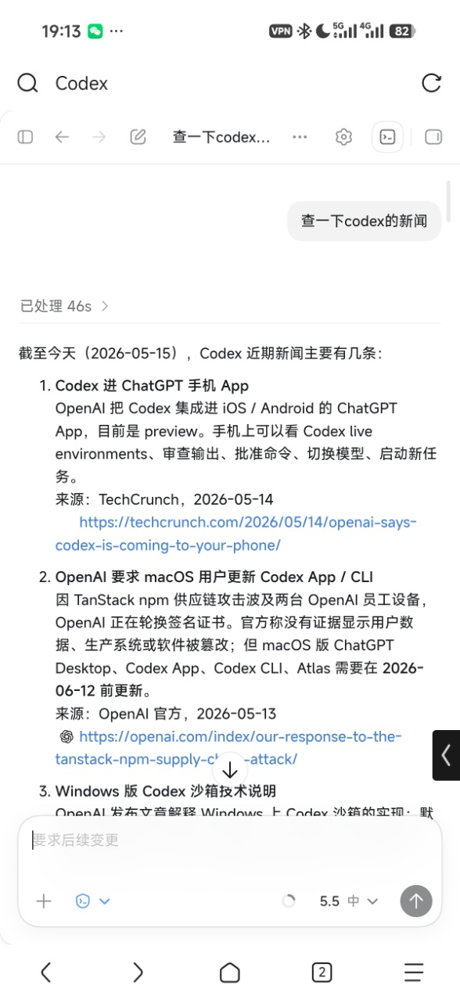

# OpenCodex

[中文](../README.md) | **English**

OpenCodex is a middleware layer for the Codex desktop runtime, compatible with both legacy Codex Desktop and the new ChatGPT Desktop app. It lets you directly use a phone, tablet, or another computer to access and operate Codex on a target machine through a browser, so you can AI Code anytime, anywhere.

---

Bad timing😭 Just as this project was about to be open sourced, ChatGPT App added Codex support.

Compared with the official option, OpenCodex still has advantages in several usage scenarios:

1. No proxy network required.
2. No overseas Google Play / Apple account is required, and remote usage with third-party API login is supported.
3. Supports full Codex capabilities, including file tree, terminal, review, and more, making anytime-anywhere AI Coding easier.
4. Freely pair it with intranet tunneling or public network access without going through the official relay server, making it faster and easier to protect private data.

---

## Features

- Access Codex on the target machine through a browser, with no proxy network or extra account requirements, and support for phones, tablets, computers, and other devices.
- Native Codex experience.
- Supports local access, LAN access, and remote LAN access with Tailscale / ZeroTier / VPN.
- Supports setting an access password to avoid unauthenticated exposure.
- Provides a launcher for visual configuration of the listen address, port, access password, and more.
- Automatically follows the local Codex/ChatGPT Desktop runtime version on startup, keeping compatibility with new-version features.
- Provides optimizations for mobile devices.

<p align="center">
  
  &nbsp;
  
  &nbsp;
  
  &nbsp;
  
</p>

## Requirements

- Node.js environment.
- pnpm.
- Legacy Codex Desktop or the new ChatGPT Desktop app with Codex installed locally. It does not need to be running, and it can still be used at the same time.
- macOS / Windows / Linux (Linux requires command-line startup; see the guide below.)

## How To Use

### Launcher

Download and install:

Open the release page, download the installer, and install it.

Local debugging:

```bash
pnpm install
```

```bash
pnpm run launcher:dev
```

Build a macOS installer:

```bash
pnpm run launcher:dist:mac
```

Build a Windows installer:

```bash
pnpm run launcher:dist:win
```

Artifacts are written to `release/`. On first startup, OpenCodex randomly selects an available port. After changing the listen address, port, or access password, it automatically restarts the service so the configuration takes effect.

> Legacy Codex Desktop or the new ChatGPT Desktop app must be installed locally before use.

### Command-Line Startup

For temporary debugging, you can also start OpenCodex from the command line.

LAN:

```bash
pnpm install
PORT=3737 pnpm run web:dev
```

Remote access support:

```bash
pnpm install
HOST=0.0.0.0 PORT=3737 pnpm run web:dev
```

`Setting an access password and changing the port are strongly recommended`. You can copy the example config and edit the password:

```bash
cp config.example.yaml config.yaml
```

Config example:

```yaml
auth:
  password: "your-password"
```

After startup, visit:

```text
http://127.0.0.1:3737
```

### Linux Usage

No prebuilt launcher is provided for Linux. Command-line usage is recommended. See the [Linux setup guide](LINUX_GUIDE_EN.md).

### Remote Access

OpenCodex itself does not provide a remote access service. If you need remote access from another device, use Tailscale, ZeroTier, Cloudflare Tunnel, a company VPN, or a similar network solution, then enable LAN mode in the Launcher.

> Public network access is also possible, but directly exposing OpenCodex to the public Internet is not recommended. The tools above are safer and easier to control.

## Common Environment Variables

| Variable | Default | Description |
| --- | --- | --- |
| `HOST` | `0.0.0.0` | Listen address for command-line gateway startup. |
| `PORT` | `3737` | Listen port for command-line gateway startup. |
| `OPENCODEX_HOST` | `127.0.0.1` | Default listen address used when the Launcher starts the gateway for the first time. |
| `OPENCODEX_PORT` | Random available port | Default port used when the Launcher starts the gateway for the first time. |
| `OPENCODEX_PREFERRED_LANGUAGES` | `zh-CN` | Preferred language list for OpenCodex-owned UI, as a JSON array or comma-separated list, for example `["zh-Hans-CN","en-CN"]`. The Launcher automatically passes the system preferred languages. |
| `OPENCODEX_PLUGIN_DIRS` | Empty | External plugin root directories matching the `web-shell/plugins` layout; pass multiple roots with the platform path delimiter or a JSON array. |
| `OPENCODEX_LOG_MAX_MB` | `10` | Size limit, in MB, for the Launcher-written `gateway.log`; at most one extra `gateway.log.old` is kept. |
| `CODEX_WEB_CONFIG_PATH` | `config.yaml` | Path to the gateway authentication config file. |
| `CODEX_WEB_AUTH_TOKEN_TTL_MS` | `43200000` | Gateway access token lifetime, 12 hours by default. |
| `CODEX_WEB_DEBUG` | Empty | Set to `1` or `true` to output more debug logs. |
| `CODEX_WEB_SLOW_LOG_MS` | `750` | Slow IPC call logging threshold, in milliseconds. |
| `CODEX_WEB_LOCAL_FILE_TOKEN_TTL_MS` | `300000` | Local file preview URL token lifetime, in milliseconds. |
| `CODEX_DESKTOP_APP_PATH` | Auto scan | Codex/ChatGPT Desktop install path or path containing `app.asar`. |
| `CODEX_DESKTOP_EXECUTABLE_PATH` | Auto scan | Codex/ChatGPT Desktop Electron executable path override on Windows/Linux. |
| `CODEX_APP_SERVER_BINARY_PATH` | Auto scan | Codex app-server/CLI executable path override on Windows. |
| `CODEX_CLI_PATH` | Auto scan | Codex CLI executable path override on Windows. |
| `CODEX_WEB_RUNTIME_DIR` | `.data/runtime` | Runtime directory for command-line gateway startup; packaged Launcher mode points this to the user data directory. |
| `CODEX_WEB_OFFICIAL_BUNDLE_DIR` | `.data/cache/codex-official-bundle` | Official bundle extraction cache directory. |
| `CODEX_WEB_OFFICIAL_AUTO_SCAN_UPGRADE` | `1` | Controls whether official Codex runtime updates are automatically scanned on startup. Set to `0` to prefer reusing the existing cache, scanning only when the cache is missing or unavailable. |
| `CODEX_WEB_OFFICIAL_USER_DATA_DIR` | `.data/official-user-data` | Isolated official Electron profile directory. |
| `CODEX_WEB_OFFICIAL_TMPDIR` / `CODEX_WEB_OFFICIAL_TMP_DIR` | Auto generated | Temporary directory for the hidden official runtime, used to isolate the official IPC socket. |
| `CODEX_WEB_REPORTS_DIR` | `.data/reports` | Gateway diagnostics report output directory. |
| `CODEX_WEB_WORKSPACE_ROOTS` | Empty | Initial workspace roots, comma-separated. |
| `CODEX_HOME` | `~/.codex` | Config and runtime data directory for Codex CLI / app-server. |

### Advanced Debug Environment Variables

| Variable | Default | Description |
| --- | --- | --- |
| `CODEX_WEB_PICKED_FILES_MAX_COUNT` | `20` | Maximum number of temporary picked-file request directories. |
| `CODEX_WEB_PICKED_FILE_MAX_BYTES` | `52428800` | Maximum size of one picked file, in bytes. |
| `CODEX_WEB_PICKED_FILES_MAX_TOTAL_BYTES` | `104857600` | Maximum total size of picked-file temporary directories, in bytes. |
| `CODEX_WEB_PICKED_FILE_TTL_MS` | `86400000` | Picked-file temporary directory retention time, in milliseconds. |
| `CODEX_WEB_DISABLE_ASSET_CACHE` | Empty | Set to `1` to disable gateway static asset caching. |
| `CODEX_WEB_DISABLE_GZIP` | Empty | Set to `1` to disable gateway gzip response compression. |
| `OPENCODEX_DEBUG_WS` | Empty | Set to `1` to enable WebSocket/app-host diagnostics. |
| `OPENCODEX_WS_LARGE_LOG_BYTES` | `262144` | WebSocket large-message log threshold, in bytes. |
| `OPENCODEX_WS_SEND_SLOW_MS` | `80` | WebSocket slow-send log threshold, in milliseconds. |
| `OPENCODEX_WS_STRINGIFY_SLOW_MS` | `20` | WebSocket JSON stringify slow-log threshold, in milliseconds. |
| `OPENCODEX_WS_BUFFERED_LOG_BYTES` | `524288` | WebSocket bufferedAmount log threshold, in bytes. |
| `OPENCODEX_APP_HOST_TRAFFIC_FLUSH_MS` | `2000` | app-host traffic stats flush interval, in milliseconds. |
| `OPENCODEX_APP_HOST_LARGE_FRAME_BYTES` | `65536` | app-host large-frame log threshold, in bytes. |
| `OPENCODEX_WS_DISABLE_DEFLATE` | Empty | Set to `1` to disable WebSocket permessage-deflate. |
| `OPENCODEX_WS_DEFLATE_THRESHOLD` | `65536` | WebSocket compression threshold, in bytes. |
| `OPENCODEX_WS_DEFLATE_CONCURRENCY` | `4` | WebSocket compression concurrency limit. |
| `OPENCODEX_WS_DEFLATE_LEVEL` | `3` | WebSocket zlib compression level. |

## FAQ

### Chat history is empty the first time a session is opened

The first load can be slow and is also affected by remote LAN bandwidth. Wait for a while, then refresh or re-enter the session.

### Session sync is not timely

If you use OpenCodex and the official Desktop at the same time, both maintain their own session state. Although they use the same data, the state may not always sync in real time.

Whether locally or remotely, it is recommended to use OpenCodex directly. With PWA support, the experience is close to the official Desktop.

### The page does not open after startup

You can first check whether the service is running:

```bash
curl http://127.0.0.1:3737/api/health
```

If the port is already in use, switch to another port:

```bash
PORT=3738 pnpm run web:dev
```

## Plugin System

OpenCodex includes a plugin system. You can use plugins to enhance Codex capabilities, and developers are welcome to build plugins based on this system.

- [Plugin development guide](PLUGINS_EN.md)

## Links

[LinuxDo](https://linux.do/)
